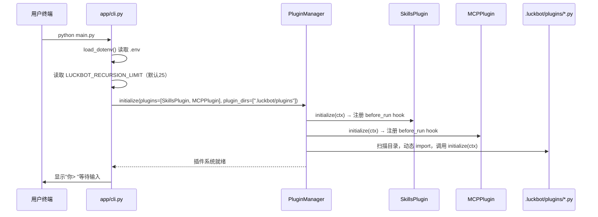
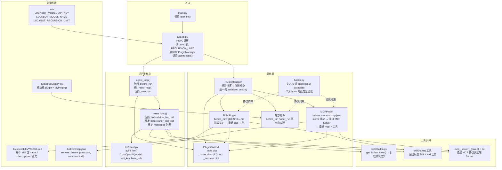

# LuckBot

基于 Python + LangChain 的轻量 Agent CLI，当前采用插件化 ReAct 循环。

## 当前目录架构

```text
LuckBot/
├── main.py                    # 程序入口（python main.py）
├── app/cli.py                 # 交互式 CLI（不读命令行参数）
├── agent/
│   ├── loop/agent_loop.py     # 自研 ReAct 循环
│   ├── plugin/                # 插件接口 / hooks / manager
│   ├── built_in/              # 内置 SkillsPlugin / MCPPlugin
│   ├── llm/client.py          # 模型客户端构建
│   └── tools/builtin.py       # 内置工具（当前为空）
├── .luckbot/
│   ├── mcp.json               # MCP 配置
│   └── skills/                # 本地 Skills
├── scripts/test_mcp_server.py # 本地 MCP 连通测试
├── requirements.txt
└── README.md
```

## 运行流程

### 阶段一：启动与插件初始化（只执行一次）



### 阶段二：每次用户输入的完整链路

```mermaid
sequenceDiagram
    participant user as 用户终端
    participant cli as app/cli.py
    participant loop as agent_loop()
    participant pm as PluginManager(hooks)
    participant llm as ChatOpenAI
    participant tool as 工具函数

    user->>cli: 输入一句话（如"帮我查一下X"）
    cli->>loop: agent_loop(user_input, pm, system_prompt, tools, max_steps)

    Note over loop,pm: ── before_run（每次 run 触发一次）──
    loop->>pm: 触发 before_run
    pm->>pm: SkillsPlugin._before_run:<br/>比对 SKILL.md 文件指纹<br/>→ 变化则重建 skill 工具<br/>→ 无变化则复用缓存
    pm->>pm: MCPPlugin._before_run:<br/>比对 mcp.json mtime<br/>→ 变化则重连 MCP Server 重建工具<br/>→ 无变化则复用缓存
    pm-->>loop: 返回合并后的 tools dict（含 skill、mcp_* 等）

    loop->>loop: 初始化 messages = [HumanMessage(user_input)]

    rect rgb(240, 248, 255)
        Note over loop,tool: ── ReAct 内循环（最多 max_steps 轮）──

        loop->>pm: 触发 before_llm_call<br/>（当前无内置实现，外部插件可用）
        pm-->>loop: 可修改 tools / system_prompt

        loop->>llm: llm.bind_tools(tools).ainvoke([SystemMessage, ...messages])
        llm-->>loop: AIMessage（含 tool_calls 或最终文本）

        loop->>pm: 触发 after_llm_call<br/>（当前无内置实现，可观测 usage）

        alt AIMessage 无 tool_calls
            loop-->>loop: 提取 response.content 作为最终回答，退出循环
        else AIMessage 有 tool_calls
            loop->>pm: 触发 before_tool_call(name, args)<br/>（当前无内置实现，可改写 args）
            loop->>tool: tool.ainvoke(args)
            tool-->>loop: 工具返回文本
            loop->>pm: 触发 after_tool_call(name, args, output)<br/>（当前无内置实现，可改写 output）
            loop->>loop: messages.append(ToolMessage(output))
            loop->>loop: 继续下一轮
        end
    end

    Note over loop,pm: ── after_run（每次 run 触发一次）──
    loop->>pm: 触发 after_run(result, messages)<br/>（当前无内置实现，可做日志/存储）
    loop-->>cli: 返回最终回答字符串

    cli->>user: 打印回答，显示"你> "等待下次输入
```

### Hook 明细

| Hook | 触发时机 | 当前有哪些插件实现 | 可修改什么 |
|---|---|---|---|
| `before_run` | `agent_loop()` 一进来 | **SkillsPlugin**（重建 skill 工具）、**MCPPlugin**（重建 mcp 工具） | `tools`、`system_prompt` |
| `after_run` | `agent_loop()` 返回前 | 无 | 只读（`result`、`messages`） |
| `before_llm_call` | 每轮调 LLM 前 | 无 | `tools`、`system_prompt` |
| `after_llm_call` | 每轮 LLM 返回后 | 无 | 只读（`response`、`usage`） |
| `before_tool_call` | 每个工具执行前 | 无 | `args`（可改写或抛异常阻断） |
| `after_tool_call` | 每个工具返回后 | 无 | `output`（可改写工具结果） |

## 组件架构



## 当前功能与实现（简要）

- 交互式多轮对话：`python main.py`，输入 `quit` / `exit` 退出。
- 自研 ReAct：`ChatOpenAI.bind_tools` + 手动 tool 调用循环。
- 插件系统：支持 6 个 hook，内置 Skills / MCP，并可加载 `.luckbot/plugins/*.py` 外部插件。
- 缓存与容错：Skills / MCP 使用指纹缓存；MCP 刷新失败时保留上次可用工具。
- 配置方式：运行参数不走 CLI，统一通过 `.env`（如 `LUCKBOT_RECURSION_LIMIT`）读取。

## 快速开始

1. `python3.13 -m venv .venv`
2. `source .venv/bin/activate`
3. `pip install -r requirements.txt`
4. `cp .env.example .env` 并填写 `LUCKBOT_MODEL_API_KEY`
5. `python main.py`
