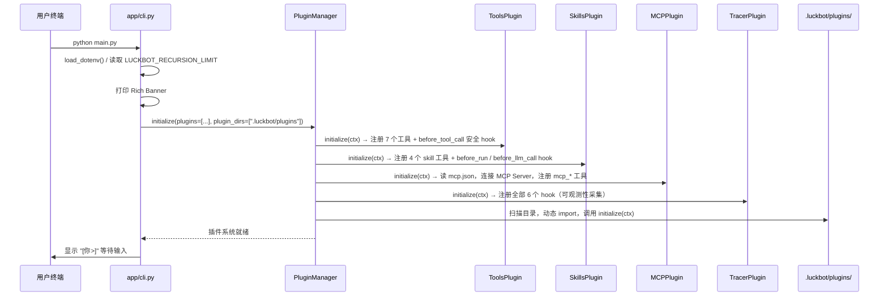
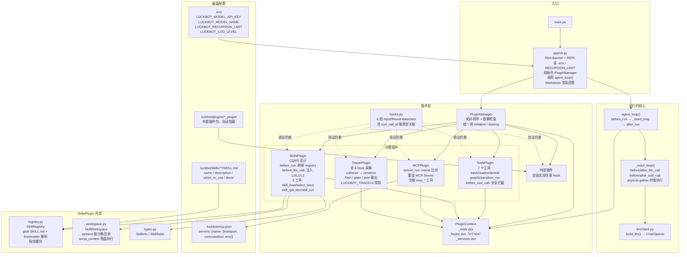

# LuckBot

基于 Python + LangChain 的轻量 Agent CLI，采用插件化 ReAct 循环。

## 当前目录架构

```text
LuckBot/
├── main.py                          # 程序入口（python main.py）
├── app/cli.py                       # 交互式 CLI（Rich 渲染，不读命令行参数）
├── agent/
│   ├── loop/agent_loop.py           # 自研 ReAct 循环（并发 tool 执行）
│   ├── plugin/                      # 插件接口 / hooks dataclass / manager
│   │   ├── base.py                  # LuckbotPlugin 抽象基类 + PluginContext
│   │   ├── hooks.py                 # 6 组 Input/Result 强类型 dataclass
│   │   └── manager.py               # 拓扑排序 + 初始化 + 热加载
│   ├── built_in/                    # 内置插件（自动发现 *_plugin/ 目录）
│   │   ├── tools_plugin/            # 基础工具集
│   │   │   ├── bash.py              # shell 命令（safety 白名单过滤）
│   │   │   ├── file_read/write/edit # 文件读写编辑
│   │   │   ├── grep.py / ls.py      # 代码搜索 / 目录列表
│   │   │   ├── sandbox_run.py       # 一次性沙箱执行（EphemeralSandbox）
│   │   │   ├── ephemeral.py         # EphemeralSandbox 实现
│   │   │   └── safety.py            # bash 命令安全分类（read/write/blocked）
│   │   ├── skills_plugin/           # Skill 系统（CQRS + 沙箱执行）
│   │   │   ├── registry.py          # SKILL.md 扫描与解析
│   │   │   ├── types.py             # SkillInfo / SkillState dataclass
│   │   │   └── workspace.py         # SkillWorkspace（session 级沙箱）
│   │   ├── mcp_plugin/              # MCP 工具桥接
│   │   └── tracer_plugin/           # 运行可观测性
│   │       ├── collector.py         # RunTrace / StepEvent / ToolCallEvent
│   │       └── renderer.py          # Rich / plain / json 三种输出格式
│   └── llm/client.py                # 模型客户端（ChatOpenAI）
├── .luckbot/                        # 本地配置（git 忽略内容，仅保留目录）
│   ├── mcp.json                     # MCP 服务配置
│   ├── skills/                      # 本地 Skills（每个子目录一个 SKILL.md）
│   └── plugins/                     # 外部插件（*_plugin/ 自动加载）
├── requirements.txt
└── README.md
```

## 运行流程

### 阶段一：启动与插件初始化（只执行一次）



### 阶段二：每次用户输入的完整链路

```mermaid
sequenceDiagram
    participant user as 用户终端
    participant cli as app/cli.py
    participant loop as agent_loop()
    participant pm as PluginManager(hooks)
    participant llm as ChatOpenAI
    participant tool as 工具函数

    user->>cli: 输入一句话
    cli->>loop: agent_loop(user_input, pm, system_prompt, max_steps)

    Note over loop,pm: ── before_run（每次 run 触发一次）──
    loop->>pm: 触发 before_run
    pm->>pm: SkillsPlugin: 刷新 skill 列表，重置本轮 state
    pm->>pm: MCPPlugin: stat mcp.json → 变化则重连 Server 重建工具
    pm->>pm: TracerPlugin: reset 采集器，记录初始 tools + base prompt hash

    loop->>loop: messages = [HumanMessage(user_input)]

    rect rgb(240, 248, 255)
        Note over loop,tool: ── ReAct 内循环（最多 max_steps 轮）──

        loop->>pm: 触发 before_llm_call
        pm->>pm: SkillsPlugin: 注入 L0（skill 概览）+ L1（已加载 skill 正文）<br/>+ L2（已选文档）到 system_prompt
        pm->>pm: TracerPlugin: 记录本步 prompt hash / 增量 diff / 长度

        loop->>llm: llm.bind_tools(tools).ainvoke([SystemMessage, ...messages])
        llm-->>loop: AIMessage

        loop->>pm: 触发 after_llm_call
        pm->>pm: TracerPlugin: 记录 tool_call_names / token usage / llm_content

        alt AIMessage 无 tool_calls
            loop-->>loop: 提取 content 作为最终回答，退出循环
        else AIMessage 有 tool_calls（并发执行）
            loop->>pm: asyncio.gather 并发触发各 before_tool_call
            pm->>pm: ToolsPlugin: bash 安全检查（blocked 命令直接拒绝）
            pm->>pm: TracerPlugin: 记录 start_time / tool_call_id
            loop->>tool: 并发 tool.ainvoke(args)
            tool-->>loop: 各工具返回文本
            loop->>pm: 并发触发各 after_tool_call
            pm->>pm: TracerPlugin: 记录 end_time / output 摘要 / 成败
            loop->>loop: messages.append(ToolMessage × N)
            loop->>loop: 继续下一轮
        end
    end

    Note over loop,pm: ── after_run（每次 run 触发一次）──
    loop->>pm: 触发 after_run(result, messages)
    pm->>pm: TracerPlugin: 记录结束时间，调 renderer 输出 trace 摘要

    loop-->>cli: 返回最终回答字符串
    cli->>user: Rich Markdown 渲染回答
```

### Hook 明细

| Hook | 触发时机 | 当前有哪些插件实现 | 可修改什么 |
|---|---|---|---|
| `before_run` | `agent_loop()` 入口 | **SkillsPlugin**（刷新列表/重置状态）、**MCPPlugin**（重连 Server）、**TracerPlugin**（重置采集器） | `tools`、`system_prompt` |
| `after_run` | `agent_loop()` 返回前 | **TracerPlugin**（输出 trace 摘要） | 只读（`result`、`messages`） |
| `before_llm_call` | 每轮调 LLM 前 | **SkillsPlugin**（注入 L0/L1/L2 到 system_prompt）、**TracerPlugin**（记录 prompt diff） | `tools`、`system_prompt` |
| `after_llm_call` | 每轮 LLM 返回后 | **TracerPlugin**（记录 usage / tool_calls）  | 只读（`response`、`usage`） |
| `before_tool_call` | 每个工具执行前 | **ToolsPlugin**（bash 安全拦截）、**TracerPlugin**（记录开始时间） | `args`（可改写或抛异常阻断） |
| `after_tool_call` | 每个工具返回后 | **TracerPlugin**（记录耗时 / 摘要） | `output`（可改写工具结果） |

## 组件架构



## 内置工具一览

| 工具 | 来源 | 说明 |
|---|---|---|
| `bash` | ToolsPlugin | shell 命令，dangerous 模式写操作需白名单 |
| `read` | ToolsPlugin | 读文件内容 |
| `write` | ToolsPlugin | 写文件（覆盖） |
| `edit` | ToolsPlugin | 按行精确替换文件片段 |
| `grep` | ToolsPlugin | 正则搜索代码 |
| `ls` | ToolsPlugin | 列目录 |
| `sandbox_run` | ToolsPlugin | 一次性隔离沙箱执行脚本 |
| `skill_load` | SkillsPlugin | 加载 skill，其文档在后续 LLM 调用中注入 |
| `skill_select_docs` | SkillsPlugin | 选择 skill 参考文档注入上下文 |
| `skill_get_doc` | SkillsPlugin | 即时返回单篇文档内容（不注入上下文） |
| `skill_run` | SkillsPlugin | 在 skill 沙箱内执行命令或 `script_content` |
| `mcp_{server}_{name}` | MCPPlugin | 动态桥接 MCP Server 暴露的工具 |

## Skill 系统（CQRS 设计）

```
skill_load / skill_select_docs   ← 写入方：改变 SkillState
before_llm_call hook             ← 读取方：将 state 注入 system_prompt

L0  每轮始终注入：可用 skill 概览列表（name + when_to_use）
L1  skill_load 后注入：对应 SKILL.md 全文（含 API 说明 / 示例）
L2  skill_select_docs 后注入：选定参考文档内容
```

`skill_run` 支持 `script_content` 参数：多行 Python 脚本直接传入参数，自动落盘到沙箱内的 `$WORK_DIR/_script.py` 并执行，禁止使用 `write` / `bash` 在项目目录创建临时脚本文件。

## 可观测性（TracerPlugin）

每轮 `run` 结束后自动在 stderr 输出调用链路摘要：

```
╭─ LuckBot Run Trace ───────────────────────────────╮
│ Duration: 3.2s  Steps: 3  Tool calls: 2           │
│ Tokens: 5,600 in / 664 out                        │
│ Skills loaded: math-calc                          │
╰───────────────────────────────────────────────────╯

Step 1  LLM -> 1 tool call(s): skill_load
  Prompt: changed (+165 chars injected)   ← 仅显示新增注入内容
  Tokens: 2,789 in / 68 out
  +-- skill_load(name="math-calc") ...... 1ms OK

Step 2  LLM -> 1 tool call(s): skill_run
  Prompt: changed (+6,620 chars injected) ← 注入了 SKILL.md 正文
  ...

Step 3  LLM -> final answer (no tools)
  Prompt: unchanged (7,283 chars)
```

环境变量控制：

| 变量 | 默认值 | 说明 |
|---|---|---|
| `LUCKBOT_TRACE` | `1` | `0` 禁用 TracerPlugin |
| `LUCKBOT_TRACE_FORMAT` | `rich` | `plain` / `json` 切换格式 |
| `LUCKBOT_LOG_LEVEL` | `WARNING` | stdlib logging 级别 |

## 快速开始

```bash
python3.13 -m venv .venv
source .venv/bin/activate
pip install -r requirements.txt
cp .env.example .env          # 填写 LUCKBOT_MODEL_API_KEY 等
python main.py
```

输入 `exit` 或 `quit` 退出。

## 外部插件

在 `.luckbot/plugins/` 下新建 `*_plugin/` 目录，`__init__.py` 中定义一个 `LuckbotPlugin` 子类，启动时自动加载。可实现任意 hook 组合。
